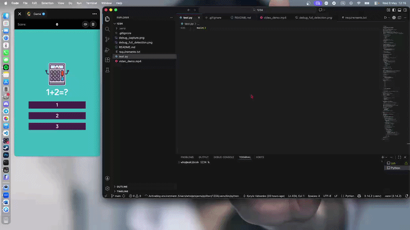
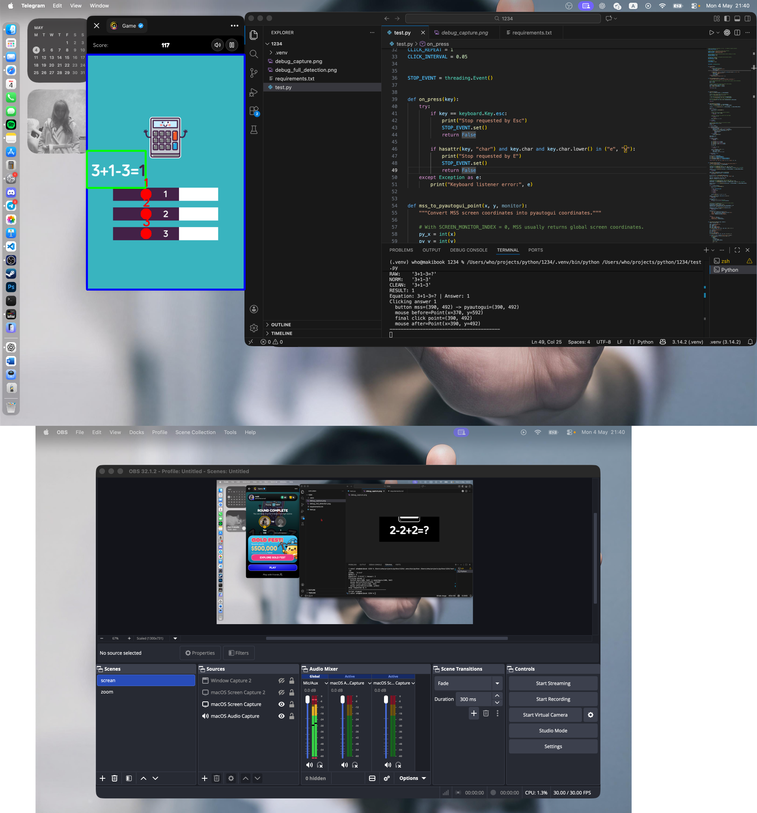

# Math Game OCR Bot

A Python bot that automatically detects a math game on the screen, reads the equation with OCR, solves it, and clicks the correct answer button.

The bot was built for a game where the user has to solve simple equations and choose one of three answers: `1`, `2`, or `3`.

## Demo





## What the Bot Detects

The debug preview shows the main computer vision steps:

- blue rectangle — detected game area;
- green rectangle — detected equation area;
- red dots — detected answer button centers.

## OCR Input

The bot also saves the cropped and preprocessed equation image that is sent to OCR:


## How It Works

The script captures the screen, finds the game interface, crops the equation, reads it with OCR, solves it, and clicks the correct answer button.

```text
Screen capture
    ↓
Game area detection
    ↓
Equation crop
    ↓
OCR recognition
    ↓
Equation solving
    ↓
Automatic click
```

## Features

- automatic game screen detection;
- equation area detection;
- answer button detection;
- OCR-based equation recognition;
- automatic answer clicking;
- debug image generation;
- stop hotkeys: `E` and `Esc`.

## Requirements

Install dependencies:

```bash
pip install -r requirements.txt
```

## macOS Permissions

The script needs permission to capture the screen, listen to keyboard input, and control the mouse.

Enable permissions for Terminal, VS Code, or the app you use to run the script:

```text
System Settings → Privacy & Security → Accessibility
```

You may also need to enable:

```text
System Settings → Privacy & Security → Screen Recording
```

## Run

```bash
python test.py
```

## Stop

Press:

```text
E
```

or:

```text
Esc
```

## Notes

This bot is tuned for the "Beat me in 1+2=3" Telegram game by Gamee. If the game design changes, the color thresholds or detection rules may need adjustment.

The bot uses `pyautogui`, so it moves the real mouse cursor to click the answer.